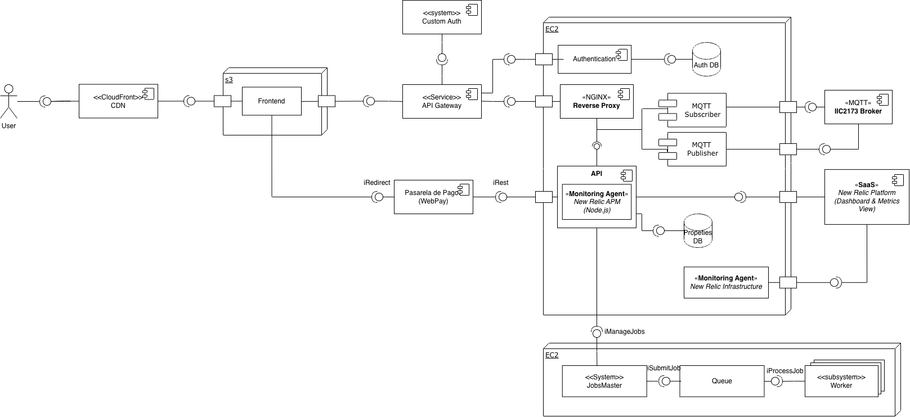

# RDOC01: Diagrama UML con explicaciones y detalle sobre el sistema. 

- CloudFront, S3 y Frontend: \
El S3 contiene la aplicación React (AuthPage, MyVisitsPage, PropertiesPage, PropertyDetailPage, y Login, Signup) y el CloudFront actúa como red de distribución de contenido que entrega el frontend a los usuarios.

    La vistas interactúan con la api, atreves el API Gateway por peticiones HTTP.

- API Gateway: \
Es el punto de entrada de las solicitudes del frontend, y autenticación o autorización, según el caso, valida los tokens y redirige la solicitudes al servicio correspondientes.

- Custom Authorization: \
Verifica tokens JWT y credenciales del usuario.

- Authentication Service: \
Este módulo representa el servicio de autenticación del sistema, con los endpoints de registro y login, y almacena los datos del usuario. Emite tokens JWT para el resto del sistema.

- API: \
Maneja la lógica de propiedades, visitas y pagos.
    - API: endpoints de la información de propiedades.
    - MQTT Subscriber: escucha mensajes de propiedades del IIC2173 MQTT Broke y actualiza la base de datos en tiempo real.
    - Database: almacena datos de propiedades, visitas, pagos.
    - NGINX Reverse Proxy: maneja balanceo, cacheo y seguridad en el tráfico HTTP.

- New Relic: \
Monitorear métricas de rendimiento de la aplicación, trazas y tiempos de respuesta.
    - New Relic APM: medir rendimiento, latencias y errores.
    - New Relic Infrastructure: corre en las instancias EC2 y recopila métricas del sistema operativo, CPU, memoria y uso de red.
    - New Relic plataform: centraliza la visualización de dashboards y alertas.

- Webpay:\
El sistema integra pago simulado por WebPay para gestionar las transacciones de compra de propiedades. El frontend redirige al usuario hacia WebPay (iRedirect), donde se procesa la transacción.Una vez completada, WebPay responde mediante una llamada REST (iRest) hacia la API, que valida la transacción y actualiza el estado de la compra en la base de datos (PurchaseIntents).
Además, este proceso activa el servicio de generación de boletas en AWS Lambda, que crea un archivo PDF con los datos del grupo, comprador y propiedad, lo almacena en S3, y retorna un enlace público.

- JobsMaster y Workers: \
El servicio JobsMaster se encarga de la orquestación de tareas de backend, como envío de correos, generación de reportes o boletas y validación de datos.
Las tareas son colocadas en una cola (Queue), donde son consumidas por Workers distribuidos que ejecutan los trabajos de forma asíncrona.