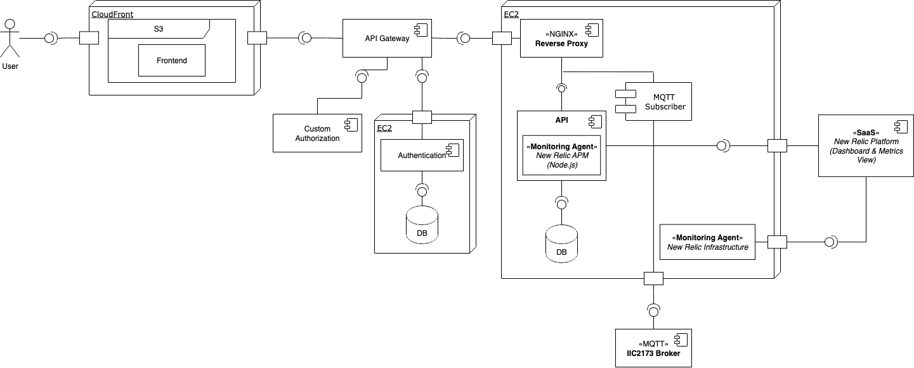

# RDOC01: Diagrama UML con explicaciones y detalle sobre el sistema. 

- CloudFront, S3 y Frontend: \
El S3 contiene la aplicación React (AuthPage, MyVisitsPage, PropertiesPage, PropertyDetailPage, y Login, Signup) y el CloudFront actúa como red de distribución de contenido que entrega el frontend a los usuarios.

    La vistas interactúan con la api, atreves el API Gateway por peticiones HTTP.

- API Gateway: \
Es el punto de entrada de las solicitudes del frontend, y autenticación o autorización, según el caso, valida los tokens y redirige la solicitudes al servicio correspondientes.

- Custom Authorization: \
Verifica tokens JWT y credenciales del usuario.

- Authentication Service: \
Este módulo representa el servicio de autenticación del sistema, con los endpoints de registro y login, y almacena los datos del usuario. Emite tokens JWT para el resto del sistema.

- API: \
Maneja la lógica de propiedades, visitas y pagos.
    - API: endpoints de la información de propiedades.
    - MQTT Subscriber: escucha mensajes de propiedades del IIC2173 MQTT Broke y actualiza la base de datos en tiempo real.
    - Database: almacena datos de propiedades, visitas, pagos.
    - NGINX Reverse Proxy: maneja balanceo, cacheo y seguridad en el tráfico HTTP.

- New Relic: \
Monitorear métricas de rendimiento de la aplicación, trazas y tiempos de respuesta.
    - New Relic APM: medir rendimiento, latencias y errores.
    - New Relic Infrastructure: corre en las instancias EC2 y recopila métricas del sistema operativo, CPU, memoria y uso de red.
    - New Relic plataform: centraliza la visualización de dashboards y alertas.